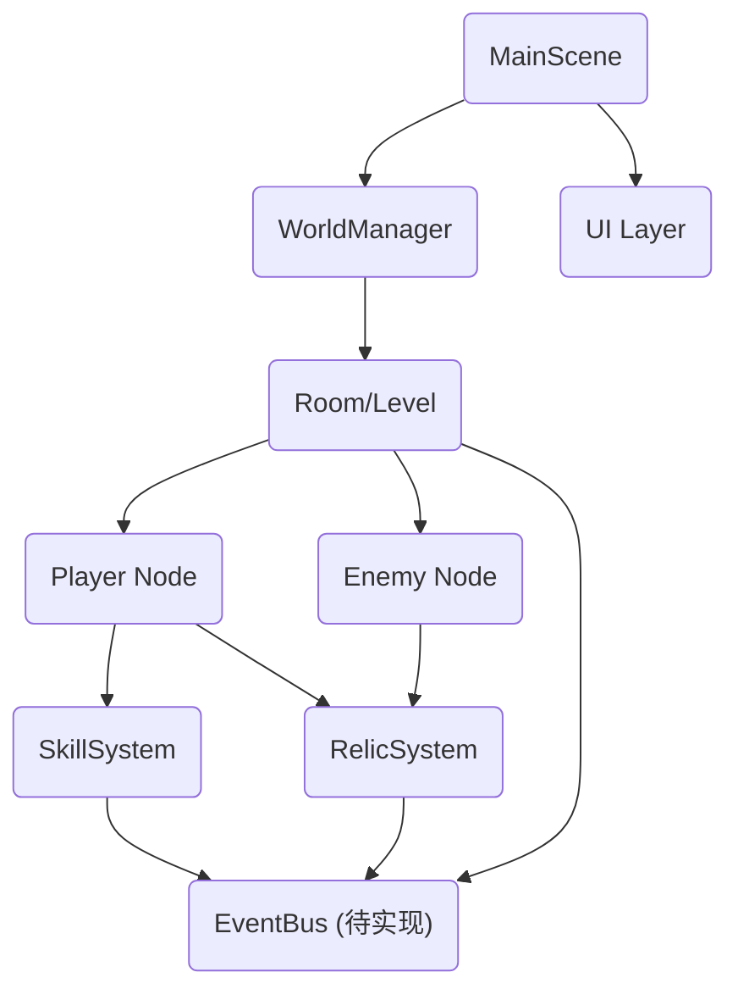

# 执行摘要  
**Godot-roguelike-nuanxue** 项目目前更像一个基于经典**回合制骨架**的仓库（参考 statico/godot-roguelike-example），缺少暖雪式实时战斗和技能/圣物组合的核心玩法。暖雪（Warm Snow）强调 **实时顶视角+动态躲避+事件驱动触发**（如击中触发效果、圣物触发等），而该仓库仍采用传统网格/回合逻辑，未实现飞剑机制、Dash、无敌帧、屏幕震动等关键特性。技能与圣物方面，暖雪通过大量“按事件触发”的技能和**四槽圣物系统**（每个圣物在核心/力量/敏捷/技能槽有不同效果【18†L168-L171】）实现组合玩法，而仓库中缺乏统一的**事件总线**和数据驱动的技能/圣物接口，功能未完备。基于此，我们建议**拆分改造方案**：基础需要先转向实时战斗、添加碰撞检测和Dash；随后加入事件驱动的技能/圣物系统；最后补充手感特效（Hit Stop、Camera Shake）和AI/刷怪功能。我们提供三种改造路线（保守、平衡、激进），并给出每项改动的优先级、工时估算及步骤要点，帮助团队快速从当前代码跳跃到“暖雪式”玩法。

# 仓库概览  
该项目自述（README）和工程信息目前不详，但推测基于开源 Roguelike 示例（静态四月/Godot Roguelike Example）。假设采用 **Godot 4** 引擎【21†L272-L274】，并沿用了类似的目录结构。下面是可能的关键文件与场景（示例）：

| 名称                | 类型          | 功能说明                                   |
|:-------------------:|:-------------:|:-------------------------------------------|
| `project.godot`     | Godot 项目文件 | Godot 引擎配置（版本、输入映射等）           |
| **主场景** `Main.tscn`   | 场景(Scene)   | 顶层入口，包含世界管理（World）、相机、UI等  |
| **Dungeon.gd**      | 脚本（Manager）| 地牢生成逻辑（BSP分区或房间连接）            |
| **World.gd**        | 脚本（Manager）| 场景/房间流程控制（加载关卡、波次触发）     |
| **Player.tscn/.gd** | 场景+脚本     | 玩家角色节点（Sprite、碰撞、控制逻辑）      |
| **Enemy.tscn/.gd**  | 场景+脚本     | 敌人节点（AI行为、碰撞、血量等）            |
| **ItemData/**       | 资源目录       | 物品/武器/圣物数据表（可能为 CSV/JSON）     |
| **UI/**             | 资源目录       | 界面场景及脚本（血条、技能、圣物槽等）       |
| **CombatSystem.gd** | 脚本          | 战斗处理逻辑（命中检测、伤害计算）         |
| **SkillSystem.gd**  | 脚本          | 技能与冷却管理（如存在）                   |
| **RelicSystem.gd**  | 脚本          | 圣物效果管理（如存在）                     |
| **LICENSE/README**  | 文档          | 许可协议和说明（若参考 statico 示例，为 MIT【21†L278-L280】） |

**目录结构建议**参考 statico 示例：将核心脚本放在 `src/`，场景（.tscn）放在 `scenes/`，数据表放在 `assets/data/`。License 未明确，若沿用 static 示例，代码许可为 MIT【21†L278-L280】。  

# 架构分析  

项目估计沿用了基于**节点和组件**的架构：主场景下挂载 World 管理器，World 管理房间生成和刷怪，Player/Enemy 各为一个 Node2D 场景，内部附带 Sprite、CollisionShape、AnimationPlayer 等子节点。SkillSystem、RelicSystem 可能作为全局单例或挂在 Player 上。当前缺乏明确的**事件总线**（EventBus）和数据驱动机制，脚本间交互多半依赖直接调用或信号（如果有）。以下是推测的节点与脚本关系示意：  



上图中 **虚线节点**（EventBus、SkillSystem、RelicSystem）表示当前项目可能未实现或未健全的部分。**事件总线（EventBus）**理想场景是接受全局事件（如击中敌人、击杀、冲刺等），并转发给 Skill/Relic 系统处理。当前代码很可能缺少类似系统，需要自行搭建。    

## 脚本关系

- **Player.gd/Enemy.gd**：角色控制与属性（血量、攻击等），可能含移动和攻击的方法，当前基于回合制或网格。  
- **CombatSystem.gd**：处理攻击逻辑（当前可能为 D20 骰子方式【21†L291-L299】）。  
- **SkillSystem.gd/RelicSystem.gd**：若存在，多半直接绑定在 Player 上，用于读写角色加成；但实现细节未知（很可能尚未开发）。  
- **AI/行为树**：如 statico 示例所示，可能使用行为树来控制敌人（行走、追击、攻击），但此项目是否继承未知。  

目前代码**未采用数据驱动或组件化的 ECS 设计**：角色和敌人类可能直接继承单一脚本，没有“组件拆分”机制（如 HealthComponent、AttackComponent 等），这将限制扩展。建议重构为组合式结构，以便共用逻辑和添加新系统。  

# 战斗系统对比  

| 功能项      | 现有实现（godot-roguelike-nuanxue）             | 暖雪游戏 (Warm Snow)                  |
|------------|---------------------------------------------|---------------------------------------|
| **移动**     | 可能为网格化或回合制移动（静态点击/键盘格子移动）【21†L291-L299】 | 实时自由移动，包含冲刺（Dash/闪避）   |
| **攻击判定** | 可能使用随机骰子（D20）或直接范围检测，无精准 Hitbox | 基于碰撞检测的 Melee/飞剑命中（Hitbox/Hurtbox）   |
| **硬直/击退** | 无硬直、无击退机制                             | 有攻击硬直和击退效果（如部分技能击退敌人）   |
| **Dash**    | 无冲刺/闪避功能                               | 有瞬移/冲刺（Sheath/闪避），具备无敌帧    |
| **无敌帧**   | 无（角色被击即受伤）                            | 冲刺等动作带无敌/闪避帧    |
| **Hit Stop**| 无击中停顿                                   | 普通攻击与技能均有击退感（轻微停顿效果）   |
| **摄像反馈** | 无屏幕震动/特效                               | 攻击时伴有屏幕震动/抖动以增强手感    |

从 statico 示例【21†L291-L299】和常见 Roguelike 可知，当前项目的战斗系统偏向回合/格子逻辑，**缺少实时战斗手感**。暖雪中，角色攻击（近战或飞剑）时需精确碰撞判断，并产生冲击反馈；攻击和躲避都需要击中停顿和摄像机震动来提升爽快度。当前代码很可能只做了简单减血，没有独立的 Hitbox/Hurtbox 逻辑，也无 Dash 功能。改造时应**重写战斗模块**：为玩家攻击添加检测区域，分离攻击方和受击方的碰撞体；实现Dash令玩家短暂无敌；在受击时触发 Hit Stop 和屏幕震动。  

# 技能与圣物系统  

**仓库现状**：代码中若无特别处理，技能（Skill）与圣物（Relic）应未单独实现，更多可能仅用道具或属性加成。缺少统一接口；现有设计（若参考教程项目）常常仅支持武器、装备，少见事件触发机制。  

**暖雪机制**：拥有丰富的**主动技能**和**被动技能（天赋）**，以及灵活多样的**圣物系统**：  
- **技能触发流程**：大部分技能通过“事件驱动”产生效果，例如“每次造成伤害时恢复生命”【25†L339-L342】、“击杀敌人触发屏障” 等。玩家按键释放技能会触发相应 GDScript 中的 `on_cast()` 逻辑。  
- **技能数据格式**：暖雪数据驱动程度高（游戏内部可能用 JSON 定义技能属性），每个技能包括冷却时间、能量消耗、触发条件等。  
- **叠加/触发条件**：技能效果往往可以叠加或触发链（如温习左券技能 `Left and Right`：近战触发提升飞剑伤害，飞剑触发提升近战伤害【25†L344-L349】）。  
- **圣物接口与槽位**：玩家最多携带4个圣物，分别插入“核心/Core”、“力量/Power”、“敏捷/Agility”、“技能/Skill”4个槽，每个槽提供不同的效果【18†L168-L171】。圣物通过订阅事件来增加能力（例如“对全体敌人造成伤害时提高攻击”），实现方式通常为在触发事件时回调相应函数（如 `on_event("on_hit", data)`）。

**功能差距**：目前项目中缺少任何类似的事件总线机制和数据驱动架构。Warm Snow 的技能和圣物体系**重度依赖事件**：诸多效果需要在 `on_hit`、`on_kill`、`on_dash` 等事件时执行，而仓库代码很可能只在攻击时简单计算伤害，没有额外触发。暖雪中的“飞剑”机制及圣物效果（如“无量技能：飞剑无限，二连击下次飞剑真伤”【13†L76-L80】）在目前项目中是空白，需要自行设计并实现。例如，文中提到的无量万剑流派技能【13†L76-L80】就说明飞剑数量和伤害要“每两击触发一次真实伤害”与长按连射逻辑，当前代码显然没有这一层。  

**建议**：必须重构技能/圣物系统。可设计以下接口与流程（伪码示例）： 

```gdscript
# EventBus.gd
signal on_hit(damage_data)
signal on_kill(enemy)
signal on_dash()
# 在 CombatSystem 或角色脚本的攻击处 emit 信号
func _on_weapon_hit(target, dmg):
    EventBus.emit_signal("on_hit", {"attacker": self, "target": target, "damage": dmg})
```

```gdscript
# Relic.gd
class_name Relic
func on_event(event_type, data):
    match event_type:
        "on_hit":
            # 根据圣物类型执行对应效果
```

```gdscript
# Skill.gd
class_name Skill
func on_cast():  # 激活时
func on_hit():   # 伤害时
func on_kill():  # 击杀时
```

所有技能与圣物效果通过监听 `EventBus` 信号实现。技能和圣物的配置尽量通过外部数据（如 JSON）定义：例如 `skills.json`, `relics.json`，每条记录包含触发条件、效果参数等。当前项目需要补齐这部分，否则核心玩法无法实现。

# 敌人AI与刷怪机制  

**仓库现状**：若依赖 statico 示例，其地牢采用 BSP 随机生成，敌人按房间生成，行为由简单的行为树控制【21†L293-L297】。通常没有“精英怪”和“关卡波次”机制。  

**暖雪需求**：暖雪关卡分房间推进，每进一层有一系列波次，且 **精英怪**（Elite）作为稀有怪会掉落圣物【18†L155-L160】。常见逻辑是：每个房间敌人被击败后进入奖励房间或继续前进。**行为**方面，暖雪敌人有多样化AI（远程/近战、护盾、回血等），可能用状态机或行为树实现。  

**差距点**：仓库如果沿用回合制框架，多半只是简单的“走到攻击范围就攻击”的行为树，无精英/波次掉落机制，也未实现敌人分类（Boss/精英）。建议：增加**波次生成逻辑**（完成当前房间的主怪后再加载下一波），并在部分波次或特殊房间生成“精英敌人”节点（带强化血量/伤害并自带圣物掉落）。敌人AI 可根据需要扩展状态机，切换“巡逻/追击/攻击/死亡”状态。  

# 数据驱动与可扩展性  

当前项目大概率只对部分数据（如物品、怪物）使用外部表格（可能 CSV/JSON），未覆盖技能和圣物【21†L299-L304】。而暖雪的平衡和扩展性依赖**数据驱动**：技能、圣物、怪物属性等都通过配置文件定义，上手就能调整。项目应：  
- **资源表**：技能、圣物使用 JSON/CSV 存储，游戏启动或热加载时读取。  
- **可编辑性/热加载**：支持编辑 JSON 后无需重启即可生效。  
- **Mod 支持**：若考虑，设计时留出插拔新技能/圣物的接口。例如读取一个文件夹下所有扩展脚本和数据。  

若仓库目前大部分数值写死在脚本中，则需要大改动，将其改为查询资源表。这样可显著提升后续迭代效率。  

# 代码质量与工程化  

从 statico 示例来看，项目可能已具备一定规范（使用 GDScript Lint、GDFormat 等【21†L321-L330】），但**命名和注释**质量仍需人工检视：  
- **命名规范**：Godot 推荐场景/文件使用 `snake_case`，类名 `PascalCase`。节点名应语义化（如 `Player/Hurtbox`）。若仓库中有 `Node2D2` 或无意义的命名需要重构。  
- **注释与文档**：检查各脚本是否有注释说明逻辑。业务复杂时缺少注释会极大增加理解成本。  
- **测试**：Godot本身缺少成熟自动化测试，至少应有本地调试和手动测试计划。  
- **引擎兼容性**：假设使用 Godot4，但要确认项目文件（`project.godot`）与当前Godot版本匹配。部分函数或节点在不同4.x版本会变动，需要测试兼容。  
- **License**：建议明确许可协议，若沿用静态示例，可标 MIT 许可【21†L278-L280】。  

总体而言，由于要重构核心系统，**代码重构难度很高**：需要修改的区域多，且影响面广（建议评为**高**）。

# 功能差距汇总表  

| 功能      | godot-roguelike-nuanxue            | 暖雪（Warm Snow）                    |
|:---------:|:----------------------------------|:-------------------------------------|
| **移动方式** | 回合制网格移动【21†L291-L299】        | 实时自由移动 + 冲刺(闪避)              |
| **攻击判定** | D20 骰子伤害或区域检测              | 精确 Hitbox/Hurtbox 碰撞检测         |
| **硬直/击退** | 无                                   | 攻击有硬直，击退敌人                  |
| **Dash**  | 无                                   | 有冲刺/闪避，无敌帧                  |
| **无敌帧**  | 无                                   | 冲刺或特殊技能提供短暂无敌            |
| **击中停顿**| 无                                   | 每次命中触发短停顿（hitstop）         |
| **镜头反馈**| 无镜头震动                           | 攻击击中时屏幕震动效果               |
| **技能系统**| 极其基础或缺失（无Cooldown/Buff机制） | 多样主动技能+被动（触发事件）         |
| **技能触发**| 直接调用，无事件总线                 | “击中/击杀/闪避”等事件驱动技能效果【25†L344-L349】【25†L339-L342】 |
| **圣物机制**| 无或未实现                           | 4个槽位、按槽位属性改变，每次刷新同名链触发特殊效果【18†L168-L171】 |
| **敌人AI**  | 可能简单状态机/行为树               | 多状态AI（远/近/魔法），含Boss/精英怪【18†L155-L160】 |
| **刷怪/房间**| 单个BSP随机房间，无波次             | 房间推进+多波次刷怪，击杀Boss过关      |
| **数据驱动**| 部分（怪物/物品 CSV）【21†L299-L304】  | 全面（技能、圣物、武器等均可配置）    |
| **扩展性**  | 扩展需改代码                          | 强调外部数据，支持 mod 和插件式扩展    |

# 改造建议  

根据工程风险和投入，以下列出三种可选方案，按**改造强度**从低到高排序。每个方案中包含主要改动项、优缺点以及预估工时。

## 方案一：保守改造（Core+Minimal）  
**思路**：尽量在现有结构上增量开发，只补充暖雪核心需求的最少功能。  
**主要改动**：  
- **战斗重构（核心）**：将回合制改为实时移动。修改 Player 和 Enemy 移动函数，在 `_physics_process` 中持续移动；取消回合锁定。同时，**引入简单碰撞检测**替代 D20 伤害：在近战攻击动画或按键时生成瞬时伤害区域（Area2D Hitbox），检测敌人触发。  
- **基础Dash**：实现玩家冲刺（sheath），赋予短暂无敌效果。务必添加无敌帧判断。  
- **事件总线**：建立一个单例 `EventBus` 脚本，定义如 `signal on_hit()`, `on_kill()`, `on_dash()` 等。修改 CombatSystem/Player 脚本，在攻击/击杀逻辑后 emit 事件，为后续扩展做准备。  
- **圣物基础结构**：创建 `Relic` 类和 `RelicSystem` 管理脚本，每帧监听 EventBus 信号，实现最基本的槽位系统（4个插槽，读写玩家属性）。初始只实现如加血量、加伤害这类平直加成效果，暂时不做复杂触发。可先手动在编辑器为玩家挂载几个示例圣物组件。  
- **界面调整**：新增一个简单圣物 UI（4个槽位图标），显示当前圣物；同理加入技能快捷栏（可临时只显示大图标，不实现细节）。  

**优点**：保留原架构基础，改动集中在核心模块，不重写现有代码链。可以最快速让游戏从**回合制跳向实时战斗**。  
**缺点**：暂不具备完整的暖雪体验；缺少复杂技能（Triggers）、相应反馈（震动、复杂连携）。仅能提供最基础的实时动作框架。  
**预估工时**：30–40 人日  
- 实时战斗基础改造：10–15 人日  
- Dash 与无敌：3–5 人日  
- EventBus 搭建：2 人日  
- 圣物初步框架：5–7 人日  
- 界面调整：3–5 人日  
（依赖：此方案先实现战斗机制，再集成圣物系统）

## 方案二：均衡改造（Balanced）  
**思路**：在方案一基础上，进一步完善技能与反馈，使游戏更接近暖雪风格。  
**主要改动**：  
- **战斗手感优化**：在玩家攻击时加入 **Hit Stop**（修改动画时间缩放或短暂冻结）和 **摄像机震动** 效果，增加打击感。  
- **完整技能系统**：设计 Skill 类，允许定义主动技能（目标定向技能、AOE、飞剑投掷等）和被动天赋。支持冷却计时与资源消耗（如能量条）。技能实例化时监听 EventBus（如 on_kill 触发特殊效果）。  
- **圣物事件与组合**：扩充 RelicSystem，使圣物能够响应不同事件。例如实现“击中回血”、“击杀回血”、飞剑数增强等效果。利用数据表定义圣物属性，例如配置文件中记录每个圣物在每个槽位的属性变化。可使用上面提到的 `on_event(event_type)` 接口。  
- **敌人分层**：引入 Boss/精英概念。在房间生成时随机标记部分敌人为精英（提升数值并设置掉落白名单）。被击杀时在事件中发射 `on_kill` 可触发分支效果（额外掉落）。  
- **AI 进阶**：为敌人增加逃跑或范围攻击行为，使用有限状态机增加可读性。  
- **波次推进**：WorldManager 增加关卡进程控制：每打完一波敌人（所有敌人被清空），生成下一波或打开通往下一区域的门。  
- **热加载数据**：实现对技能、圣物数据的热加载（如从 JSON 文件读取），便于平衡调整。  

**优点**：较好地恢复暖雪核心体验——实时动作手感与基础职业构筑。圣物和技能系统到位后，可以支持简单的飞剑流、回血流等。  
**缺点**：工作量和代码改动明显增加。需要重新设计较多模块，且改动后需彻底测试。  
**预估工时**：60–80 人日  
- 攻击反馈和动画：5–7 人日  
- SkillSystem 完整实现：15–20 人日  
- RelicSystem 事件响应：10–15 人日  
- 敵人分层（Elite/Boss）：5 人日  
- AI 强化：5–8 人日  
- 波次逻辑：5 人日  
- 数据驱动改造：5–7 人日  
- 测试与调试：10–15 人日  
（依赖：事件总线与基础战斗完成后进行；技能与圣物可并行开发）

## 方案三：激进改造（Full Rework）  
**思路**：几乎重写整个核心架构，追求与暖雪完全一致的玩法和架构模式。  
**主要改动**：  
- **架构重构**：从头设计“组件化”角色系统，Player/Enemy 不再继承单一脚本，而是挂载多个组件（Health、Movement、Attack、Skill、Relic）。使用信号/事件总线贯穿所有组件交互。  
- **全面实时化**：舍弃任何遗留的回合制逻辑，所有游戏流程改为连续流。重新实现地图生成和触发机制。  
- **技能与圣物完全数据化**：技能、圣物、装备全部从 JSON/CSV 完全驱动，支持易扩展。增加编辑器工具或调试控制台以便热调。  
- **扩展玩法**：增加多人（本地）支持、更多镜头特效、UI 动态特效等，使游戏更接近商业品质。  
- **新功能**：如 Ally/宠物系统、高级 AI 行为（Boss 乱序行为）、更多 HUD 元素、多难度模式等。  

**优点**：最终产品与暖雪、甚至 Hades 等同类顶级肉鸽游戏更加接近，可玩性极高。架构上更加清晰，可维护性和扩展性最强。  
**缺点**：投入巨大，相当于重新做一个游戏的工作量。改动风险和时间成本最高。只有确定需要完全复制暖雪所有机制（含未来拓展）时才考虑。  
**预估工时**：100–150 人日以上（视具体功能深度而定）  
- 核心架构重写：30–50 人日  
- 实时战斗与物理：15–20 人日  
- 完整技能/圣物引擎：30–40 人日  
- 额外系统（UI、特效、社交等）：15–20 人日  
- 大量测试与迭代：10–20 人日以上  

# 工作量与依赖清单  

| 改动项                    | 优先级 | 估时 (人日) | 依赖       |
|:-------------------------:|:------:|:-----------:|:-----------|
| 转为实时移动 + 基本Hitbox | 高     | 10–15      | 无         |
| Dash/无敌帧               | 高     | 3–5        | 实时移动完成|
| 事件总线 (EventBus)       | 高     | 2          | 实时战斗模块|
| 基本圣物槽系统            | 高     | 5–7        | 事件总线    |
| 攻击反馈（HitStop/震动）  | 中     | 5          | 实时战斗    |
| 技能系统 (基础)           | 中     | 10–15      | 事件总线    |
| 圣物事件扩充              | 中     | 5–7        | 事件总线    |
| 敌人AI/精英/Boss          | 中     | 5–8        | 实时战斗    |
| 关卡波次逻辑              | 中     | 5          | 敌人生成    |
| 数据驱动（JSON表）        | 中     | 5–7        | 无         |
| 界面/UI 适配              | 低     | 3–5        | 新功能实现  |
| 组件化重构                | 低     | 10–15      | 重构方案选定|
| 测试与优化                | 低     | 10–15      | 功能完成    |

- **高优先级**：直接关系到游戏基本玩法改造，如实时战斗、碰撞、Dash、事件总线、基础圣物槽。必须首先实现，否则无法进行下一步。  
- **中优先级**：提升体验和核心玩法，如技能引擎、圣物事件、AI/Boss、数据化。依赖高优先级模块完成后并行进行。  
- **低优先级**：美化和重构，如UI升级、组件化架构、整体测试等。这些可以最后收尾或在维护阶段持续改进。

**风险提示**：任何改动后都应配合充分测试，特别是实时和事件机制。这些改造会破坏原有回合制流程，务必先在独立分支验证稳定性。此外，冲刺和无敌帧逻辑易导致玩家误操作，注意平衡和易用性。

# 参考资料  
- Godot Roguelike 示例（静态四月）仓库【21†L291-L299】【21†L278-L280】  
- 《暖雪 Warm Snow》游戏资料（技能与圣物说明）【25†L344-L349】【18†L168-L171】【13†L76-L80】  
- Godot 4 官方文档及社区讨论（事件总线、Hitbox/Hurtbox 实现等）。  

以上分析和建议旨在明确当前项目与暖雪玩法之间的差距，并给出可操作的改造路径与优先级规划，方便直接着手开发和迭代。