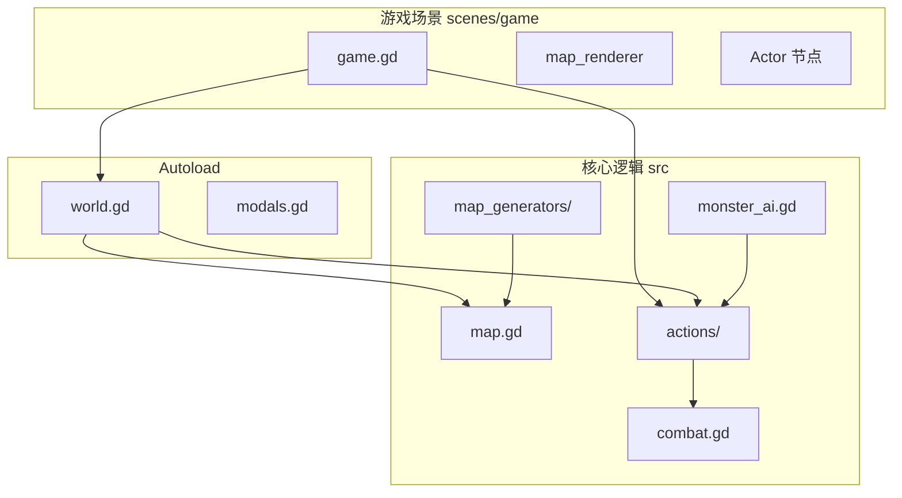

# 当前工程设计（现状归档）

本文档描述 **本仓库当前** 的架构与数据流，基于 Godot 4 的回合制格子 Roguelike 示例（源自 Statico 开源示例并本地化扩展）。面向后续「暖雪式」实时动作迁移时，文末标注各模块的 **保留 / 需适配 / 可能废弃** 倾向。

---

## 1. 工程与入口

| 项目 | 说明 |
|------|------|
| 主场景 | `project.godot` 中 `run/main_scene` 为 `res://scenes/menu/main_menu.tscn` |
| 全局单例（Autoload） | `World`、`Async`、`Modals`、`ItemTiles`、`WorldTiles`、`CharacterTiles` |
| 核心逻辑语言 | GDScript，游戏状态以 `RefCounted` 数据类 + 场景表现层分离 |

---

## 2. 模块职责总览

---

## 3. World（`src/world.gd`）

- **职责**：全局游戏状态、当前地图、玩家引用、回合序号、阵营好感等。
- **初始化**：`initialize()` 创建 `WorldPlan`、用 `MonsterFactory` 生成玩家（如 `knight` + `Roles` 装备）、生成第一层地图并设为 `current_map`。
- **回合推进**：`apply_player_action(action: BaseAction)` 是核心节拍器：
  1. 对玩家动作 `action.apply(current_map)`，得到 `ActionResult`。
  2. 更新所有怪物状态效果、负重等；处理玩家营养消耗与自然治疗（与 `current_turn` 挂钩）。
  3. 为每个怪物累加 `energy`，对 `energy >= Monster.SPEED_NORMAL` 的怪物执行 `get_next_action`（行为树产出 `ActorAction`）并扣能量。
  4. 区域效果、视野更新；广播 `effect_occurred`、`message_logged`、`turn_ended`；`current_turn += 1`。
- **信号**：`map_changed`、`effect_occurred`、`turn_started` / `turn_ended`、`game_ended`、`energy_updated` 等。

**实时化标注**：需 **适配** — 节拍从「单次玩家输入 = 一整回合」改为时间步或独立系统；营养/治疗/多敌行动的触发条件需重定义。

---

## 4. Action 模型（`src/actions/`）

- **基类**：`BaseAction` → `apply(map)` → `_execute`，统一产出 `ActionResult`（成功标志、消息、效果列表等）。
- **玩家动作**：如 `PlayerAttackMoveAction`（移动并尝试近战）、`PlayerFireAction`、`PlayerPickupAction`、`PlayerRestAction`、楼梯/开门等，均继承自 `ActorAction` / `BaseAction` 体系。
- **效果**：`ActionEffect` 子类（`MoveEffect`、`AttackEffect`、`ProjectileEffect`、`DeathEffect` 等）供 `game.gd` 做演出排序与 `await` 播放。

**实时化标注**：**需适配** — 动作可保留为「离散事件」（拾取、交互），但移动与攻击的主路径将让位于连续控制与命中框；效果队列与全局 `await` 需与帧循环解耦。

---

## 5. 地图与格子（`src/map.gd`、`src/map_cell.gd`）

- **结构**：二维 `cells[x][y]`，每格 `MapCell` 含地形、障碍、物品列表、怪物引用。
- **坐标**：逻辑上使用 `Vector2i`；怪物位置通过「从旧格移除、写入新格」更新。
- **视野**：`visible_cells` / `seen_cells` 与阴影投射等算法配合（详见 `Map` 内更新方法），支持战争迷雾。

**实时化标注**：地图 **可保留** 作为碰撞与渲染底图；**需适配** 怪物在格子上唯一占用与连续位移的语义；视野更新频率可降频。

---

## 6. 怪物与数据（`src/monster.gd`、`src/monster_factory.gd`、`assets/data/*.csv`）

- **Monster**：`RefCounted`；含 HP、力量、速度常量、`Energy`、营养、状态效果、`Equipment`、`Inventory`（`Set`）、`behavior_tree`、`faction`、`skill_levels` 等。
- **速度**：`SPEED_*` 常量用于与 `energy` 配合决定多行动回合。
- **数据**：`monsters.csv`、`items.csv` 等由工厂读取并构造实体（导入为 Keep，避免翻译管线）。

**实时化标注**：属性与装备 **保留**；`energy` 与回合多动 **需适配** 或改为 CD/攻击间隔。

---

## 7. 战斗（`src/combat.gd`、`src/damage.gd`、`src/dice.gd`）

- **近战**：`Combat.resolve_melee_attack` — D20 攻击检定、力量/技能加值、对 AC 判定命中，再算伤害与抗性。
- **远程与其它**：同类文件内解析射击、投掷等（与装备槽、技能类型相关）。

**实时化标注**：数值与伤害类型 **可部分保留**；D20 单次检定 **可能废弃** 或仅用于非实时玩法；需新增 **命中体积与时间轴**。

---

## 8. 敌人 AI（`src/monster_ai.gd`）

- **行为树**：`BTNode` / `BTSequence` / `BTSelector` 等；`tick(actor, map)` 返回 `SUCCESS` / `FAILURE` / `RUNNING`。
- **决策**：可见性检测、朝向玩家移动、攻击等，与格子寻路（`src/pathfinding.gd`）配合。

**实时化标注**：**需适配** — 树可保留，但触发频率与「移动一步」语义要改为按帧或按时间片；`RUNNING` 可跨帧扩展。

---

## 9. 装备与物品（`src/equipment.gd`、`src/item.gd`）

- **槽位**：`Equipment.Slot` 含护甲多层、`MELEE`、`RANGED` 等；`can_equip` 与怪物身体部位标志关联。
- **物品**：类型、数量、嵌套容器等；与 UI 拖拽、地面拾取联动。

**实时化标注**：**保留** 数据模型；扩展「流派武器 / 技能绑定」时在此或 Resource 层 **适配**。

---

## 10. 地图生成（`src/map_generators/`、`src/world_plan.gd`）

- **BSP**：`dungeon_generator.gd` 等生成房间与走廊；`WorldPlan` 管理多层地牢计划与关卡切换。
- **工具**：`scenes/debug/map_generator_tool.tscn` 用于预览参数。

**实时化标注**：**保留** — 生成结果仍是格子地图，与实时战斗不冲突。

---

## 11. 渲染与表现（`src/map_renderer.gd`、`scenes/actor/actor.gd`）

- **地图**：TileMap/精灵批量绘制与视野裁剪。
- **Actor**：`Node2D`，`grid_pos` 与 `Constants.TILE_SIZE` 映射世界坐标；移动用插值动画；受击、死亡等 Shader/粒子。

**实时化标注**：**需适配** — 实体坐标随连续运动更新；地图仍可格子渲染。

---

## 12. UI（`src/modals.gd`、`scenes/ui/`）

- 模态栈、背包/装备界面、HUD、日志等；异步 `await Modals.prompt_for_direction()` 等。

**实时化标注**：**保留** 框架；**需适配** 暂停规则（全屏菜单是否冻结游戏）。

---

## 13. 主游戏循环（`scenes/game/game.gd`）

- 输入 → `_check_player_input()` 构造 `BaseAction` → `_handle_player_action` → `World.apply_player_action` → `_flush_effects_queue`（排序与 `await`）→ 重绘地图与 `_update_actors`。
- `waiting_for_player_input` 在回合之间等待；支持点击移动路径、右键射击等。

**实时化标注**：**需大幅适配** — 输入与 `_process` / `_physics_process` 绑定；弱化「每回合阻塞」。

---

## 14. 数据流小结

1. **输入** → `BaseAction`  
2. **World.apply_player_action** → 逻辑 + 敌回合 + 系统  
3. **信号与效果队列** → 表现层  
4. **CSV / 工厂** → 运行时实体  

---

## 15. 迁移倾向（实时动作）

目标为 **纯即时制** 时，**不必保留**完整回合链：可删除 `apply_player_action` 驱动主循环、`waiting_for_player_input`、与 `current_turn` 强绑定的系统，无需「回合 / 即时」双模式。下表仍用「保留 / 适配」用语，但整段回合逻辑可归入 **删除或重写** 而非并行保留。

| 模块 | 倾向 |
|------|------|
| `WorldPlan`、BSP 生成、`Map` 地形/视野 | 保留 |
| `Item` / `Equipment`、CSV 数据驱动 | 保留，扩展槽位或 Resource |
| `Damage` 类型、抗性 | 保留数据，换结算方式 |
| `Combat` D20 流程 | 可删除主路径，换动作结算 |
| `apply_player_action` 单轴节拍 | **可删除**，改即时事件 / 新 `World` API |
| `Monster.energy` 多动 | **可删除**，改为 CD / 攻击间隔 |
| `game.gd` 效果队列与回合等待 | **可删除或重写**，与即时循环分离 |
| `Actor` 格步动画 | 需适配为连续运动 |
| `MonsterAI` 格子 BT | 需适配 |

---

## 16. 参考文件索引

| 领域 | 路径 |
|------|------|
| 回合与回合 | `src/world.gd` |
| 动作基类 | `src/actions/base_action.gd` |
| 移动 | `src/actions/move_action.gd` |
| 战斗 | `src/combat.gd` |
| AI | `src/monster_ai.gd` |
| 地图 | `src/map.gd` |
| 渲染 | `src/map_renderer.gd` |
| 主场景逻辑 | `scenes/game/game.gd` |
| 数据 | `assets/data/items.csv`、`assets/data/monsters.csv` |
| 架构说明（英文） | [`README.md`](README.md)（仓库根另有入口说明） |
